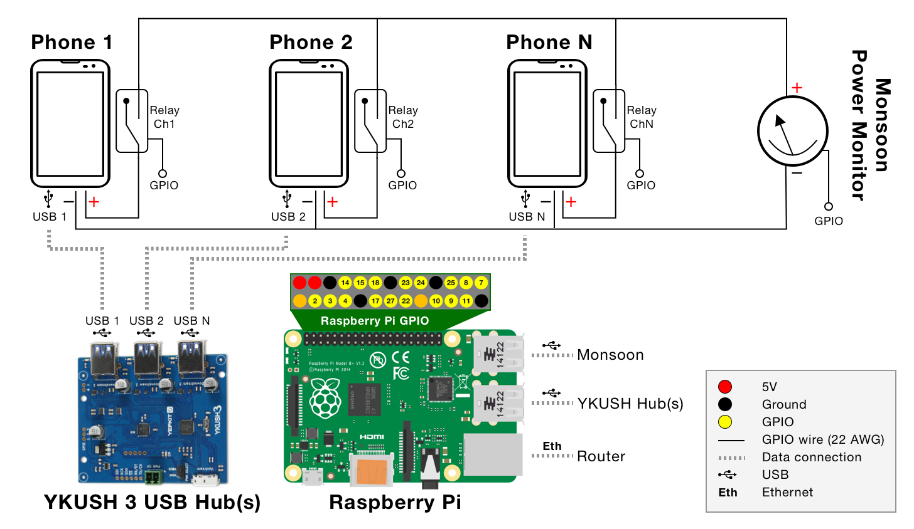

# BLaDE: Setup

## Hardware Requirements

These are the main components required to create a BLaDE node:

- [Raspberry Pi](https://www.raspberrypi.com/products/) (4 or greater, preferably 5 with 8-16GB of RAM)
- [Monsoon HVPM](https://www.msoon.com/high-voltage-power-monitor) (High Voltage Power Monitor)
- [YKUSH 3 USB Switchable Hub](https://www.yepkit.com/product/300110/YKUSH3) (amount depends on the number of devices you want to support)
- 8-channel Relay Board Module, compatible with the Raspberry Pi GPIO (e.g., [this](https://www.amazon.co.uk/Yizhet-Channel-Optocoupler-Raspberry-Channels/dp/B07MJF9Z4K))
- Power Switch Relay (e.g., [this](https://www.amazon.co.uk/gp/product/B0765WBGK6)) (optional, if you want to automate power cycling of Monsoon)
- Externally powered USB Hub (e.g., [this](https://www.amazon.co.uk/gp/product/B07KFGY2CR)) (optional, if you want to connect multiple YKUSH boards, or if the power from the Pi is not sufficient)

Additional components such as cables, connectors, external SSD, and microSD card are also required.

## System Design



The relay board module requires a 5V power supply from the GPIO (red pin) and to be connected to the ground (black pin). Each channel of the relay board is connected to the Raspberry Pi GPIO pins (yellow pins). The pin numbers can be configured from `src/tools/configs/channels.json`.

The Monsoon device is connected to the Raspberry Pi via USB (USB 2.0 port). The Monsoon device can optionally be connected to a separate Power Switch Relay in order to automate power cycling. The relevant GPIO can be configured from `src/tools/configs/monsoon.json`.

The YKUSH 3 USB Switchable Hub is connected to the Raspberry Pi via USB (USB 3.0 port). Each YKUSH USB port is then connected to the phone's USB port. The YKUSH USB ports can be configured from `src/tools/configs/devices.json`. External power is also recommended for the YKUSH 3 USB Switchable Hub. Alternatively, you can connect the Pi with an externally powered USB hub, and connect the YKUSH boards on it. For more details, please refer to the [YKUSH 3 User Manual](https://ykushboards.yepkit.com/docs/ykush3/reference/).


## Setup the BLaDE node

Install the latest version of [Raspberry Pi OS (64-bit) with Desktop](https://www.raspberrypi.com/software/operating-systems/#raspberry-pi-os-64-bit) on a Raspberry Pi connected to the Internet over Ethernet.

Configure the user as `blade` with a password of your choice. For headless configurations please refer to [that article](https://www.raspberrypi.com/documentation/computers/configuration.html#configuring-a-user).

Connect to the Pi via SSH and (optionally but highly recommendable) copy your local pub key to `.ssh/authorized_keys`.

Run the following commands:

```bash
sudo apt update
sudo apt dist-upgrade -y
sudo apt autoremove -y
sudo apt install -y git
```

Clone the repository under `~/blade`.

Now run the setup script:

```bash
cd blade/src/setup/
bash setup.sh
```

The device will install the required packages, do the appropriate configuration to the OS, and eventually reboot.

As a final step, you need to set the YKush USB hub default state for USB devices to `Off`, following the instructions [here](https://www.learn.yepkit.com/reference/ykushcmd-reference-ykush3).


## Configure Monsoon

Connect the Monsoon device to the Raspberry Pi, power it on and read the USB `id` by running `lsusb`. The output should look similar to the following:

```text
Bus 001 Device 097: ID 2ab9:0001 Monsoon Solutions Inc. Mobile Device Power Monitor
```

Update the Monsoon device details at `src/tools/configs/monsoon.json`:

```json
{
    "gpio_pin": 12,
    "model": "HVPM",
    "usb": {
        "id": "2ab9:0001"
    }
}
```


## Configure devices

### Battery Bypass Procedure

To configure a device, you need to complete a battery-bypass procedure that includes opening the device, extracting the internal battery, removing the battery controller board, and connecting the battery terminals directly to the device's power terminals. This procedure is necessary to ensure that the device is not powered by the battery and that the current is distributed (and monitored) from the Monsoon device. For more information, please refer to Monsoon's [Mobile Device Power Monitor Manual](http://msoon.github.io/powermonitor/PowerTool/doc/Power%20Monitor%20Manual.pdf).

**Before** starting the battery bypass procedure, please power it on and connect it to the BLaDE USB Hub and BLaDE WiFi network.

Next, add a new entry with the device details at `src/tools/configs/devices.json`, an example is shown below:

```json
    "Galaxy S23": {
        "os": "Android",
        "friendly_name": "Galaxy S23",
        "type": "Samsung Galaxy S23",
        "supported_automations": ["ADB", "BT-Android"],
        "wifi": "5Ghz",
        "adb_identifier": "RFSVC5KV7PW",
        "ip": "192.168.1.66",
        "battery_capacity": 3785,
        "monsoon": {
            "channel": "ch4",
            "voltage": 4.0
        },
        "usb": {
            "id": "04e8:6860",
            "ykush_serial": "K1L15543",
            "ykush_port": 1
        }
    }
```

Details about the device can be retrieved as follows:

- `adb_identifier`: Connect the device to the Raspberry Pi and run `adb devices` to identify the device's `id`. If this is not available, check below for more information on how to set up the device.
- `ip`: Check the local IP address from the router's admin panel or the device's settings.
- `battery_capacity` and `voltage`: You can see that when you disassemble the device and check the battery's specifications. Google can also be helpful.
- `usb` `id`: Run `lsusb` as mentioned earlier to identify the device's USB `id`.


### Setup a new device

#### ADB-based Automations (Android only)

Each device has different requirements for enabling ADB. For most devices, you need to enable Developer Options and USB Debugging. For more information, please refer to the [Android Developer documentation](https://developer.android.com/studio/debug/dev-options).

Please make sure that the device can be connected to the Raspberry Pi via USB. Then, run `adb devices` to check if the device is connected and recognized by the Raspberry Pi.


#### BT-based Automations (Android and iOS)

A device needs to be `paired` and `trusted` to successfully connect to `btk_server`.

Type `sudo bluetoothctl` to execute the Bluetooth Control utility. Next, configure it for inbound pairing by running the following commands:

```text
agent on
pairable on
default-agent
discoverable on
```

BLaDE should now be discoverable from your mobile device. Go to Bluetooth (Settings > Bluetooth for iOS) and click on the discovered `BLaDE` device.

`bluetoothctl` will display a pairing confirmation message, similar to the following example:

```text
[CHG] Controller DC:A6:32:DD:67:E9 Discoverable: yes
[NEW] Device 5C:3E:1B:F2:F6:53 BLaDE iPhone 14 Pro
Request confirmation
[agent] Confirm passkey 170704 (yes/no): yes
...
[agent] Authorize service 0000110e-0000-1000-8000-00805f9b34fb (yes/no): yes
```

Type `yes` to successfully pair your device with BLaDE. Make a note of your device's mac address (e.g. `71:30:2D:25:D3:1A`). Next, use the following command to also consider your device trusted.

```text
trust <device mac address>
```

Finally, add the device's mac address as an entry into `src/tools/configs/devices.json`:

```json
{
    "Device X": {
        "bt_mac_address": "<device mac address>",
    }
}
```

For iOS device support, you will also need to enable "Full Access Keyboard" at the device's settings screen (Settings > Accessibility > Keyboards > Full Access Keyboard > On).

For further configurations at the device level, please refer to the [OS Configurations](OS_CONFIGURATIONS.md) section.
